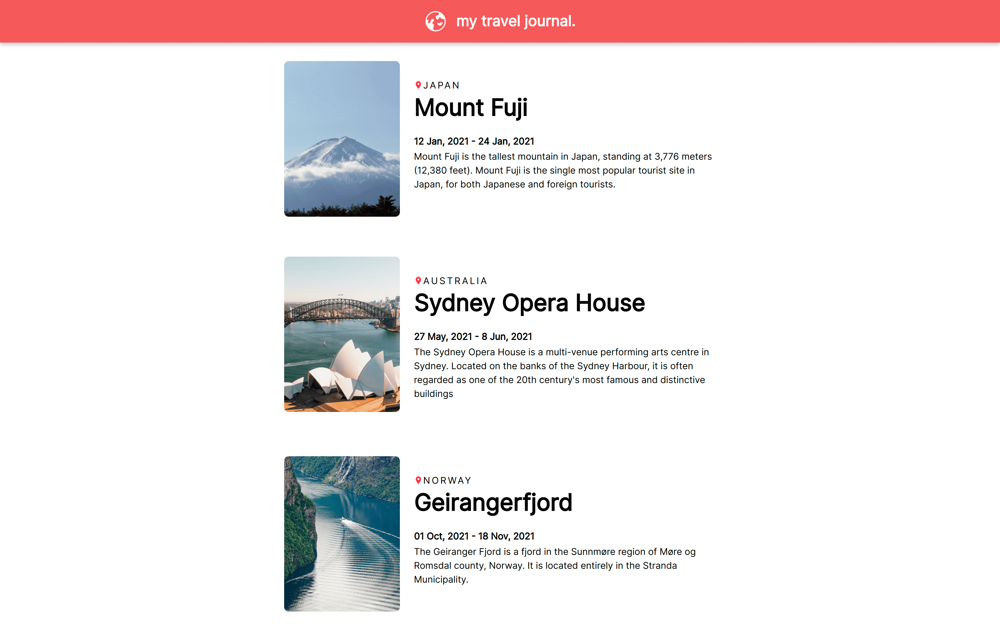
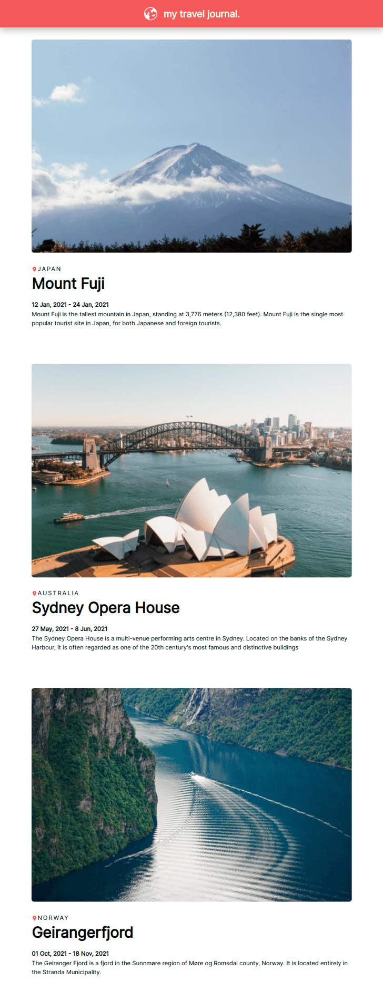

  <h3 align="center">Travel Journal</h3>

  

    A responsive website built with React.js!
     
    <a href="https://travel-journal-react-zeta.vercel.app/"><strong>View demo »</strong></a>
  

## About The Project

## License

Distributed under the MIT License. See `LICENSE.txt` for more information.

## Acknowledgments

* [Scrimba.com - Learn React for Free](https://scrimba.com/playlist/pqQgrcN)
* [Scrimba Discord](https://scrimba.com/discord)
* [Charlie-li-li](https://github.com/Charlie-li-li)
* [Vercel.com](https://vercel.com/)
* [Best README Template](https://github.com/othneildrew/Best-README-Template)
* [Inter - Google Fonts](https://fonts.google.com/specimen/Inter)
* [Icons8](https://icons8.com/)

(<a href="#top">back to top</a>)

